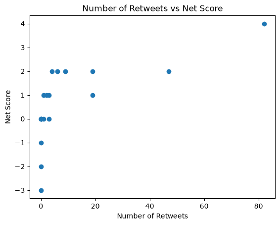

# Twitter Sentiment Classifier

A Python-based sentiment analysis project that analyzes Twitter data and calculates positive, negative, and net sentiment scores for each tweet.

## Project Overview

This project reads Twitter data from a CSV file and uses sentiment-scoring functions to analyze the sentiment of each tweet.

For every tweet, the program calculates:

* Number of Retweets
* Number of Replies
* Positive Score
* Negative Score
* Net Score

The results are saved to a new CSV file and visualized using a scatter plot.

## Features

* Reads Twitter data from a CSV file
* Calculates positive sentiment scores
* Calculates negative sentiment scores
* Calculates net sentiment scores
* Generates a resulting CSV file
* Generates a scatter plot
* Visualizes the relationship between retweets and net sentiment

## Project Structure

```text
twitter-sentiment-classifier/
│
├── assets/
    ├── negative_words.txt
    ├── positive_words.txt
│   └── project_twitter_data.csv
│
├── main.py
├── sentiment.py
├── resulting_data.csv
├── scatter_plot.png
└── README.md
```

## Requirements

* Python 3.x
* Matplotlib

Install Matplotlib using:

```bash
python -m pip install matplotlib
```

## How It Works

The program reads the Twitter data from:

```text
assets/project_twitter_data.csv
```

Each row contains information about a tweet, including:

* Tweet text
* Number of retweets
* Number of replies

The tweet text is passed to the sentiment analysis functions:

```python
positive_score = get_pos(tweet_text)
negative_score = get_neg(tweet_text)
```

The net sentiment score is calculated as:

```python
net_score = positive_score - negative_score
```

The calculated results are then written to:

```text
resulting_data.csv
```

## Output Data

The resulting CSV contains the following columns:

| Column               | Description                                     |
| -------------------- | ----------------------------------------------- |
| `Number_Of_Retweets` | Number of times the tweet was retweeted         |
| `Number_of_Replies`  | Number of replies to the tweet                  |
| `Positive_Scores`    | Positive sentiment score                        |
| `Negative_Scores`    | Negative sentiment score                        |
| `Net_Scores`         | Difference between positive and negative scores |

### Net Score Calculation

```text
Net Score = Positive Score - Negative Score
```

For example:

```text
Positive Score = 5
Negative Score = 2
Net Score = 5 - 2 = 3
```

A positive net score indicates that the tweet contains more positive sentiment, while a negative net score indicates more negative sentiment.

## Data Visualization

The project generates a scatter plot to visualize the relationship between the number of retweets and the net sentiment score.

* **X-axis:** Number of Retweets
* **Y-axis:** Net Score
* **Chart Type:** Scatter Plot

### Scatter Plot



The scatter plot allows us to visually examine whether there is a relationship between tweet popularity and sentiment.

## Running the Project

Clone the repository:

```bash
git clone <your-repository-url>
```

Navigate to the project directory:

```bash
cd twitter-sentiment-classifier
```

Install the required dependency:

```bash
python -m pip install matplotlib
```

Run the program:

```bash
python main.py
```

The program will generate/update:

```text
resulting_data.csv
```

and generate the scatter plot:

```text
scatter_plot.png
```

## Technologies Used

* **Python 3**
* **CSV module**
* **Matplotlib**
* **Sentiment Analysis**

## Learning Objectives

This project demonstrates practical use of:

* Reading CSV files
* Writing CSV files
* `csv.DictReader`
* `csv.writer`
* Iterating through CSV data
* Working with dictionaries
* Type conversion
* Creating and importing Python modules
* Using functions from another Python file
* Basic sentiment analysis
* Calculating derived values
* Data visualization
* Creating scatter plots with Matplotlib

## Author

**Gurudutt Jangid**
